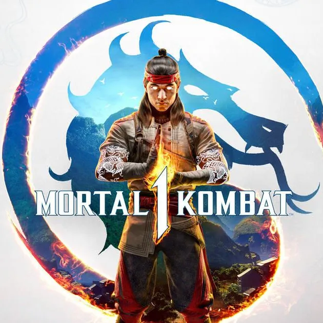
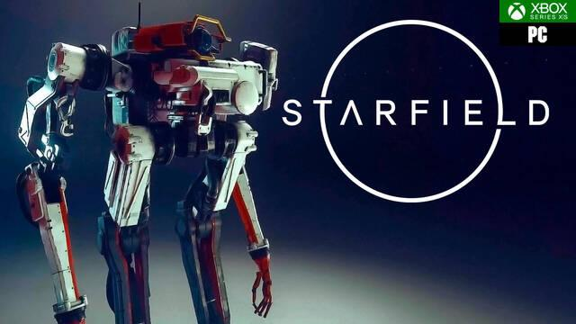

## Videojuegos, Videojuegos y más Videojuegos

En esta página vamos a hablar sobre los Videojuegos de los últimos dias como por ejemplo:

- Mortal Kombat 1  
- Lies Of P  
- Starfield  

Y muchos mas, pero hoy vamos ha hablar sobre esos juegos.

### Mortal Kombat 1  

És un videojuego de **lucha** desarrollado por NetherRealm Studios y publicado por Warner Bros. Games. Es la duodécima entrega principal de la serie Mortal Kombat y una secuela de Mortal Kombat 11 (2019). Mortal Kombat 1 es el segundo reinicio suave de la serie, tras Mortal Kombat (2011).​ El videojuego salió a la venta para PlayStation 5, Xbox Series X/S, Nintendo Switch y Microsoft Windows, el 19 de septiembre de 2023.

  
*© Copyright 2023*  

### Lies of P

És un souls-like de acción ambientado en un mundo oscuro al estilo de la Belle Époque, que nos introduce en la piel de la marioneta P. Experimenta profundas decisiones narrativas y una progresión del personaje altamente personalizable mientras guías a P en su inexorable periplo hasta convertirse en humano.

  
*© Copyright 2023*  

### Starfield

És un juego de rol occidental de ciencia ficción para Xbox Series S y X, así como para PC, que basa su jugabilidad en la exploración de planetas y la simulación espacial. Desarrollado por Bethesda Softworks, es su nueva gran saga para un jugador, su primera gran producción completamente nueva en 25 años y uno de los títulos más ambiciosos para el estudio.

  
*© Copyright 2023*  

**Mis otras páginas web por si quieres visitarlas:**  
  
[Chistes Malos](index.md)  

[Notícias del Fútbol](pag1.md)  

[La música de Hoy](pag2.md)  

